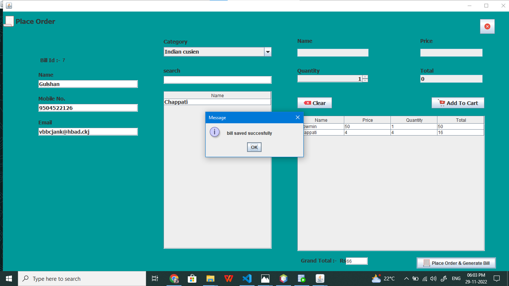

# Restaurant_Management_System
Java is used as front end for GUI interface.\
Oracle SQL is used for creating database and for Retrieving the data where it is required .\
This System provide Facilities for Booking table in restaurant, maintaining food item list,
maintaining orders and generating bills by restaurant.
## How To Use it.
Step1:- Cloning this repository in your System Named 'Restaurent_Management_System'.
Step2:- Open NetBeans IDE and import this Project.
Step3:- add itextpdf.jar file in your project library in NetBeans IDE

## This is build using NetBeans IDE.

### Home

### PlaceOrder

### Place Order and Bill Generated

### This is the Format of bill generated in .pdf format

